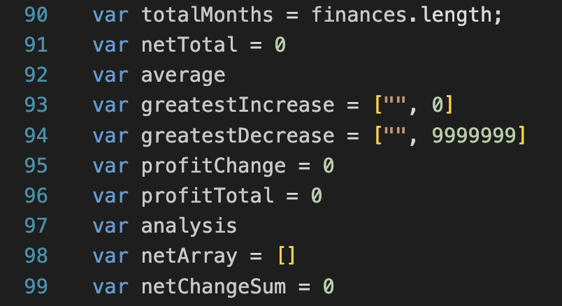
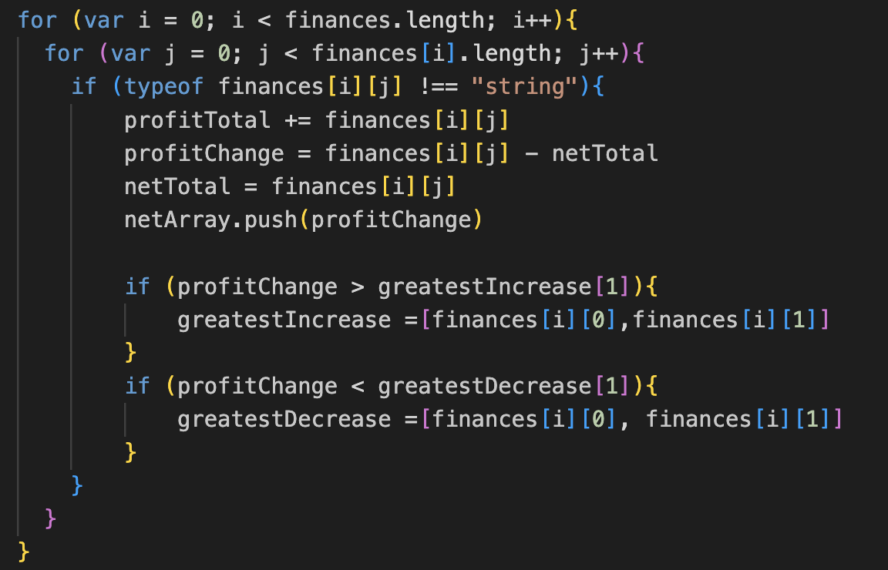
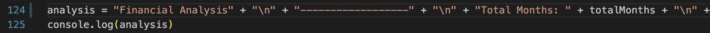

# Console-Finances

## Description

**My motivation for this project was to:**

*Write **JavaScript** code that analyzes the records to calculate each of the following:*

- The total number of months included in the dataset.
- The net total amount of Profit/Losses over the entire period. 
- The average of the changes in Profit/Losses over the entire period.
- The greatest increase in profits (date and amount) over the entire period.
- The greatest decrease in profits (date and amount) over the entire period. 

**What i learned from completing this project:**

I learned how important it is to plan out the structure of your code prior to starting, this is done by *pseudo* code. This really helped navigate my code. 

Firstly i created a list of variables.

Variables are containers for storing data. 

I created *for* loops. **For** loops, loops through a block of code a number of times.

*if* statement is used to specify a block of code to be executed, if a specific condition is true. 

Lastly i used *console.log()*. This is a method in the browser to display data.

## GitHub

https://github.com/bex-ford/Console-Finances

## Licence 

NONE